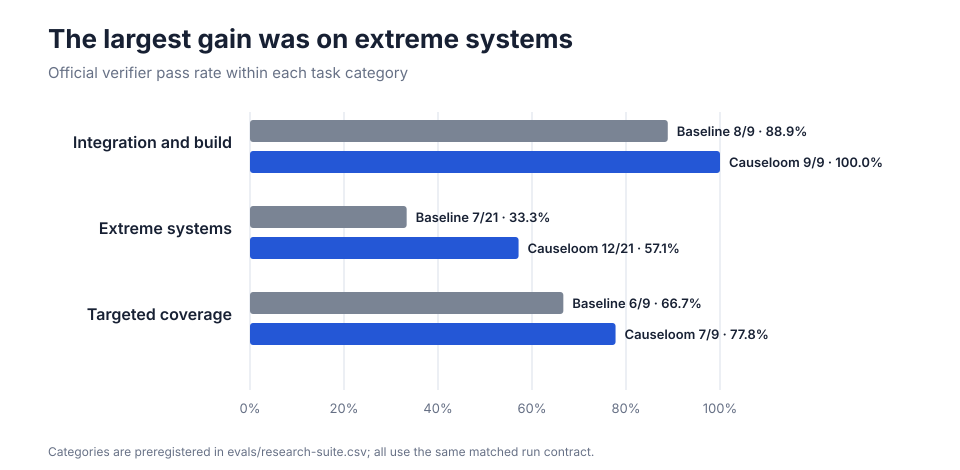
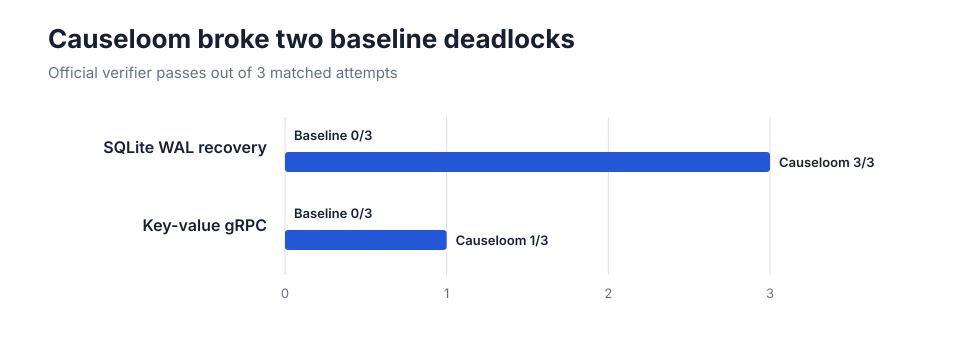

<h1 align="center">Causeloom</h1>

<p align="center"><strong>Trace the cause. Weave the solution.</strong></p>

<p align="center">
  <a href="https://github.com/zyhe16/causeloom/actions/workflows/ci.yml"></a>
  
  
</p>

Causeloom is a coding-agent skill that traces software problems to their root
causes, then weaves requirements, repository evidence, implementation, and
verification into solutions that are correct, complete, and no more complex
than necessary.

In a matched 78-run [benchmark](#results), Causeloom completed 28 of 39 attempts
versus 21 of 39 for the same agent without the skill, representing a **33.3%
relative improvement**.

```text
Understand -> Bound -> Change -> Verify -> Simplify -> Stop
```

## Why use it?

Coding agents often do too little or too much. They may make a small patch that
does not solve the real problem, or build a large solution for something
simple. Causeloom guides the agent toward work that is correct, focused, and
properly tested.

| Without Causeloom | With Causeloom |
|---|---|
| Guesses and starts coding | Checks important assumptions first |
| Fixes only what looks broken | Finds and fixes the real cause |
| Adds features for imagined future needs | Adds only what the task needs |
| Stops when the code builds | Tests the result people will actually use |
| Leaves temporary or unused code | Cleans up before finishing |

Causeloom does not mean "write the fewest lines." The solution must first be
correct and safe. Then it should be made as simple as possible.

## Install

### Agent Skills CLI (recommended)

```bash
npx skills add zyhe16/causeloom
```

> [!NOTE]
> **Codex-only, non-interactive install:** if the agent selector glitches, use
> `npx skills add zyhe16/causeloom --agent codex -y`.

### Ask your coding agent

Alternatively, ask an agent to install it for you:

```text
Install Causeloom from https://github.com/zyhe16/causeloom using
`npx skills add zyhe16/causeloom`. Select the correct coding tool, verify that
the installed skill is named `causeloom`, validate its SKILL.md, and do not
modify unrelated files.
```
> [!WARNING]
> Non-deterministic installation method is not recommended.

Invoke the installed skill with `$causeloom`; in ChatGPT desktop, type `@` and
select **Causeloom**. More details are in
[`docs/INSTALLATION.md`](docs/INSTALLATION.md).

## Results

All 13 benchmark problems come from
[Terminal-Bench 2.0](https://www.tbench.ai/benchmarks/terminal-bench-2), with
three attempts per problem for both Causeloom and the baseline. This was one
fully matched run: the same model, tasks, seed, time limits, tools, and isolated
environment for both conditions.


| Setup | Passed runs | Passes without exceptions | Timeouts | Average tokens per run |
|---|---:|---:|---:|---:|
| No-skill baseline | 21/39 (53.8%) | 21/39 | 0 | 2,590,533 |
| **Causeloom** | **28/39 (71.8%)** | **28/39** | 0 | **2,491,074** |

> [!IMPORTANT]
> The official verifier is an automated functional test, not a blinded
> code-quality score. Terminal-Bench 2.0 is also public and may appear in model
> training data.

That is a **17.9 percentage-point increase** and **7 additional completed
runs**. Causeloom also used **3.8% fewer normalized tokens in total**. Token use
varied sharply by problem—especially on the extreme tasks—so treat it as a
cost diagnostic, not a quality score.

### Where Causeloom was strongest

These are study group names, not scores:

| Group | What it means | Problems included |
|---|---|---|
| **Integration and build** | Medium-sized tasks where several tools or services must work together | C++ heap debugging, multi-branch Git deployment, and an instrumented SQLite build |
| **Extreme systems** | Longer, harder systems tasks with distributed, low-level, performance, recovery, or security constraints | Batching, cross-compilation, WAL recovery, tensor and pipeline parallelism, MIPS emulation, and HTML sanitization |
| **Targeted coverage** | Extra tasks added to test behaviors the original core did not isolate | Stopping after a sufficient modernization, launching a real gRPC service, and making a surgical vulnerability fix |



The largest difference appeared on the seven extreme systems problems:
**12/21 passes with Causeloom versus 7/21 without it**. These tasks cover
recovery, distributed tensor operations, emulation, cross-building,
performance scheduling, and adversarial HTML handling. Causeloom did not solve
everything: both conditions remained 0/3 on the Doom cross-build and HTML
sanitizer tasks.

### Problems the baseline never completed



On WAL recovery and the live gRPC service, Causeloom produced **4 passes in 6
runs; the baseline produced 0**. Across all 13 task groups, Causeloom improved
five, tied eight, and was worse on none.

### Method, briefly

- GPT-5.6 Luna, max reasoning, Codex CLI 0.146.0
- Terminal-Bench 2.0, 13 problems × 2 conditions × 3 repetitions = 78 runs
- 3 medium integration/build tasks, 7 extreme systems workflows, 3 targeted
  coverage tasks
- Published a6 run: four times the upstream agent limits; no run reached them
- Fresh isolated Harbor container and Codex home for every attempt
- No general internet access during tasks; official automated tests decide
  whether a run passes
- 78/78 raw sessions, final code exports, verifier results, and token records
  preserved; the closeout audit found zero violations or warnings

> [!NOTE]
> The published a6 evidence used four times the upstream agent limits, and all
> 78 runs finished before them. The current a7 benchmark standard removes the
> agent timeout entirely. A fixed cutoff mixes up two questions: whether a
> model can solve the problem and whether it can solve it quickly. Elapsed time
> and tokens remain visible as cost diagnostics instead.

A shared seed controls ordering but does not make hosted model trajectories
deterministic, so every task-condition cell has three repetitions. Technical
details, file hashes, chart-ready data, and instructions for repeating the run
are in [`docs/benchmarks`](docs/benchmarks/) and [`evals`](evals/).

## Code-quality review

> [!NOTE]
> This review happened after the benchmark and was not blind. It did not give
> the code a numeric score. The automated benchmark results above remain the
> main score.

Codex reviewed the saved final code and official verifier output. These are
shortened excerpts from the new matched Luna run. The tensor examples compare
`X04-baseline-r1` with `X04-causeloom-r1`; the stdout example compares
`X05-baseline-r2` with `X05-causeloom-r2`. The final two compare the matched
C01 repetition 1 and X01 repetition 3 runs.

### 1. Accept both valid input shapes

The baseline always sent the input directly into a rank-local weight:

```python
output_parallel = F.linear(input, self.weight, None)
```

Causeloom handled either a full tensor or the smaller partition already owned
by the rank:

```python
if input.size(-1) == self.in_features and self.world_size > 1:
    input = _SplitLastDim.apply(input, self.input_partition_sizes, self.rank)
elif input.size(-1) != local_input_size:
    raise ValueError(...)
```

Result: this Causeloom run passed all 13 tensor-parallel checks; the matched
baseline run passed 5.

### 2. Put each distributed operation in the right direction

The baseline all-reduced the row-parallel gradient again during backward,
which multiplied a gradient that should stay rank-local:

```python
grad_input = grad_output.contiguous().clone()
torch.distributed.all_reduce(grad_input)
return grad_input
```

Causeloom reduced the partial outputs in the forward pass and returned the
local gradient unchanged in backward:

```python
output = input.clone()
dist.all_reduce(output, op=dist.ReduceOp.SUM)
# backward
return grad_output, None
```

Result: output and gradient checks passed at world sizes 1, 2, and 4.

### 3. Preserve output on the real program path

The baseline buffered guest stdout and only flushed it later:

```javascript
this.stdoutParts.push(Buffer.from(source));
if (this.stdoutLength >= 16 * 1024) this.flushOutput();
```

Causeloom wrote stdout immediately:

```javascript
const stream = fd === 1 ? process.stdout : process.stderr;
stream.write(bytes);
return count;
```

Result: the Causeloom run passed execution, image creation, and image-similarity
checks. The matched baseline produced the correct image but lost the required
stdout before the verifier stopped the process.

### 4. Remove unused configuration and CLI surface

Both C01 runs passed, but the baseline added a configuration reader and two CLI
options even though the program never used the configuration:

```python
self.config_path = Path(config_path)
self.config = self._read_config()
parser.add_argument(
    "--config",
    type=Path,
    default=DEFAULT_CONFIG_PATH,
)
```

Causeloom kept the required path explicit and split the work into two small,
testable functions:

```python
def main() -> None:
    data = load_temperature_data(DEFAULT_DATA_PATH)
    print_station_mean_temperatures(data)
```

Result: both passed both official checks, while the Causeloom implementation
was 1,291 bytes versus 3,232 bytes and owned no unused configuration contract.

### 5. Use the simplest batching rule that meets the contract

Both X01 runs passed all six checks, including the performance thresholds. The
baseline built a weighted interval knapsack to decide which batches to merge:

```python
states: list[dict[int, tuple[float, list[int]]]] = [
    {} for _ in range(len(batches) + 2)
]
states[0][0] = (0.0, [])
```

Causeloom grouped requests by a shared shape and used one bounded generation
window:

```python
if (
    current
    and current_min_gen is not None
    and request["gen_len"] - current_min_gen > generation_window
):
    batch_number += 1
    plan.extend(
        _batch_records(current, f"b-{batch_number:04d}", seq_align)
    )
    current = []
```

Result: both satisfied schema, feasibility, coverage, and performance. The
Causeloom packer was 4,516 bytes versus 8,300 bytes, with fewer moving parts to
maintain.

The lesson is not "write more code." It is: honor the real input contract,
place distributed work on the correct path, and verify observable behavior.
The review also found clear limits: neither condition solved the Doom
cross-build or adversarial HTML sanitizer reliably.

## Strengths and tradeoffs

| Works well for | Limits |
|---|---|
| Complex systems work with several interacting parts | It can still build too much or choose the wrong approach |
| Builds, recovery, distributed code, and emulation | It did not improve the two hardest failed task groups |
| Inputs that can arrive in more than one valid form | Token use varies widely by task |
| Work that needs end-to-end verification | The evidence comes from one model and 13 public problems |

## How it works

The policy asks the agent to:

1. Turn the request into clear checks for success.
2. Find the real cause before changing code.
3. Make the smallest change that fully solves the problem.
4. Check valid inputs and make sure existing behavior still works.
5. Test the final program, not only one step along the way.
6. Remove extra code and stop when there is enough proof that it works.

Read the complete policy in [`SKILL.md`](SKILL.md) and its rationale in
[`docs/DESIGN.md`](docs/DESIGN.md).

## Motivation

Causeloom is strongly motivated by two projects that encourage direct, simple
solutions:

- [Karpathy Guidelines](https://github.com/multica-ai/andrej-karpathy-skills)
- [Ponytail](https://github.com/DietrichGebert/ponytail)

It adds a stronger focus on asking useful questions, putting fixes in the right
place, keeping existing behavior safe, testing according to risk, cleaning up,
and finishing with proof that the result works.

## Develop

```bash
make check
make package
make package-repo
```

The repository contains the skill, repeatable packaging tools, benchmark tools,
and the data used in the charts. Large raw benchmark files, private comparison
rules, caches, logs, and generated archives are not stored in Git.

## License

[MIT](LICENSE)
