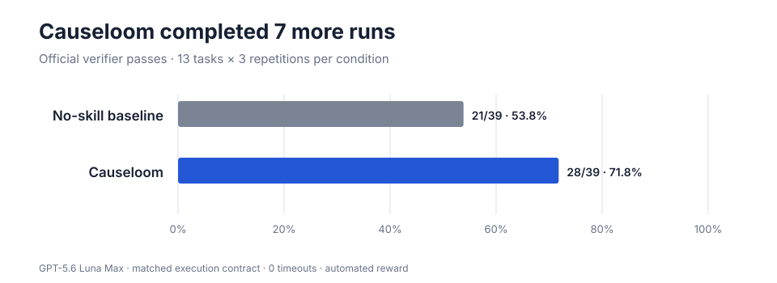
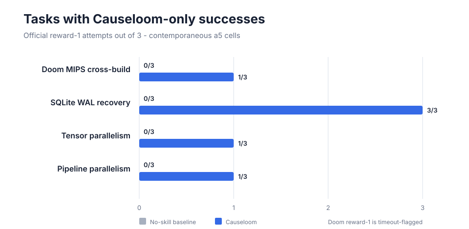

<h1 align="center">Causeloom</h1>

<p align="center"><strong>From root cause to verified closure.</strong></p>

<p align="center">
  <a href="https://github.com/zyhe16/causeloom/actions/workflows/ci.yml"></a>
  
  
</p>

Causeloom is an instruction-only engineering skill for coding agents. It keeps
an agent focused on the real requirement, the layer that owns it, and the final
entrypoint that proves the work is done.

**In a 39-attempt benchmark, Causeloom completed 27 attempts versus 20 for the
same agent with no additional skill.**

```text
Understand -> Bound -> Change -> Verify -> Simplify -> Stop
```

## Why use it?

Coding agents commonly fail in two opposite directions: they make the smallest
wrong patch, or build a large speculative system around a misunderstood
problem. Causeloom treats both as failures of causal scope.

| Without Causeloom | With Causeloom |
|---|---|
| Silently commits to an assumption | Resolves ambiguity by consequence |
| Patches the visible symptom | Finds the authoritative owner |
| Adds compatibility “just in case” | Demands evidence for lifecycle cost |
| Stops when code compiles | Verifies the real entrypoint |
| Keeps scaffolding from exploration | Simplifies the finished diff |

It is not “write the fewest lines.” Correctness is the gate; simplicity is what
remains after the requirement is actually satisfied.

## Install

### Agent Skills CLI (recommended)

```bash
npx skills add zyhe16/causeloom
```

> [!NOTE]
> **Codex-only, non-interactive install:** if the agent selector glitches, use
> `npx skills add zyhe16/causeloom --agent codex -y`.

### Ask your coding agent

Alternatively, ask an agent to choose the correct user-level directory:

```text
Install Causeloom from https://github.com/zyhe16/causeloom using
`npx skills add zyhe16/causeloom`. Select the appropriate agent harness, verify
that the installed skill is named `causeloom`, validate its SKILL.md, and do
not modify unrelated files.
```

Invoke the installed skill with `$causeloom`; in ChatGPT desktop, type `@` and
select **Causeloom**. More details are in
[`docs/INSTALLATION.md`](docs/INSTALLATION.md).

## Results

All 13 selected problems come from
[Terminal-Bench 2.0](https://www.tbench.ai/benchmarks/terminal-bench-2), with
three attempts per condition for each problem.



| Condition | Official successes | Exception-free successes | Timeouts | Mean tokens / attempt |
|---|---:|---:|---:|---:|
| No-skill baseline | 20/39 (51.3%) | 19/39 | 4 | 420,488 |
| **Causeloom** | **27/39 (69.2%)** | **25/39** | 4 | 523,594 |

That is a **+17.9 percentage-point** raw success-rate difference and six more
exception-free completions. Causeloom used about **24.5% more tokens per
attempt**. The extra usage is consistent with what the skill asks the agent to
do: trace ownership, test plausible boundaries, verify the runnable entrypoint,
and perform a final simplification/closure pass. Tokens are therefore a cost
tradeoff, not a quality score—and this benchmark does not isolate which step
caused the increase.

### Where the difference appeared



Across these four technically complex tasks, Causeloom produced **6 official
successes in 12 attempts; the baseline produced 0**. The Doom success passed
all verifier checks but is timeout-flagged, so it is shown as official reward,
not as an exception-free completion.

### Method, briefly

- GPT-5.6 Sol, high reasoning, Codex CLI 0.146.0
- Terminal-Bench 2.0, 13 tasks, 3 repetitions, isolated Harbor containers
- 3 medium integration/build tasks, 7 extreme systems workflows, 3 targeted
  coverage tasks
- Agent internet access blocked; official verifier reward is the correctness
  measure

The evaluation ran in two phases to avoid unnecessary reruns. Twelve completed
baseline cells came from the earlier phase and used its shorter timeout
contract. Both phases used the same task selection, model family, repetitions,
and run-order seed, but a shared seed does not make hosted model trajectories
deterministic. The combined view is **descriptive evidence, not a fully matched
causal estimate**. Full provenance, hashes, task selection, and reproduction
notes are in [`docs/benchmarks`](docs/benchmarks/) and [`evals`](evals/).

## Code-quality review

**Codex with GPT-5.6 Sol** reviewed preserved final artifacts and verifier traces.
This was a post-hoc engineering review, not a blinded numeric score. These are
abridged excerpts from actual benchmark submissions.

### 1. Preserve a valid distributed boundary

The baseline rejected the already-local tensor shard used by the row-parallel
caller:

```python
if input.size(-1) != self.in_features:
    raise ValueError(...)
local_input = _ScatterLastDimension.apply(input, self.world_size, self.rank)
```

Causeloom accepted either valid boundary and only sliced the full form:

```python
if input.size(-1) == self.in_features_per_rank:
    local_input = input
elif input.size(-1) == self.in_features:
    start = self.rank * self.in_features_per_rank
    local_input = input.narrow(-1, start, self.in_features_per_rank)
else:
    raise ValueError(...)
```

Result: Causeloom passed all column/row, world-size, bias, forward, and gradient
checks; the baseline failed the row-parallel contract.

### 2. Match communication order to gradient ownership

The baseline reversed the AFAB backward microbatch order:

```python
for microbatch_index in range(microbatch_count - 1, -1, -1):
    ...
```

Causeloom kept the verified FIFO pairing between stage sends and receives:

```python
for microbatch_index in range(num_microbatches):
    ...
```

Result: Causeloom passed the two-rank forward/backward comparison; the baseline
produced a layer-gradient mismatch.

### 3. Build for the runtime that actually executes the artifact

The baseline produced an ELF, but its runtime never emitted the requested
frame:

```make
CROSS ?= mips-linux-gnu-
CC := $(CROSS)gcc
LDFLAGS := -EL -m elf32ltsmip -T mips_vm.ld
# ... my_stdlib.c
```

Causeloom aligned the target, linker, and small libc shim with the supplied VM:

```make
CC := clang
CFLAGS := --target=mipsel-unknown-linux-gnu --sysroot=/usr/mips-linux-gnu ...
$(LD) -m elf32ltsmip -static -T mips.ld -o $@ $(OBJECTS)
# ... vm_libc.c
```

Result: `node vm.js` produced the frame and the verifier passed execution,
existence, and image-similarity checks. This run later hit the agent time limit,
which is why the success remains timeout-flagged.

The useful pattern across the three examples is not “more code.” It is explicit
ownership of interface shape, communication order, and the final runtime
contract. The main review risk was the opposite: on source-preserving HTML
sanitization, Causeloom overbuilt custom parsers that still failed preservation.

## Strengths and tradeoffs

| Strong fit | Tradeoffs |
|---|---|
| Distributed or stateful code with multiple owners | More inspection and verification can cost more tokens |
| Cross-builds and multi-step runtime delivery | It can still overbuild when preservation should dominate |
| Ambiguous boundaries where cheap compatibility is possible | Same number of timeout-flagged attempts in this benchmark |
| Work that needs an auditable final artifact | Evidence is one model and one 13-task suite |

## How it works

The policy asks the agent to:

1. Translate the request into observable success checks.
2. Trace the owning cause before changing code.
3. Choose the smallest intervention that can be correct.
4. Validate boundaries and compatibility in proportion to risk.
5. Verify the final entrypoint—not an intermediate approximation.
6. Remove unjustified machinery and stop when evidence is sufficient.

Read the complete policy in [`SKILL.md`](SKILL.md) and its rationale in
[`docs/DESIGN.md`](docs/DESIGN.md).

## Motivation

Causeloom is strongly motivated by two thoughtful projects that champion direct,
simple solutions:

- [Karpathy Guidelines](https://github.com/multica-ai/andrej-karpathy-skills)
- [Ponytail](https://github.com/DietrichGebert/ponytail)

It extends that motivation with consequence-based ambiguity, lifecycle
ownership, preservation, authoritative boundary placement, risk-scaled
verification, simplification, and verified closure.

## Develop

```bash
make check
make package
make package-repo
```

The repository contains the canonical skill, deterministic packaging, public
baseline evaluation tooling, and chart-ready evidence. Raw sessions, private
calibration policies, caches, logs, and generated archives stay out of source
history.

## License

[MIT](LICENSE)
